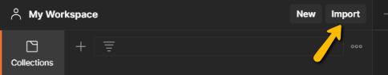
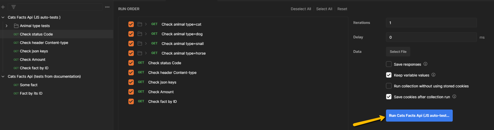

 # Автотесты API [cat-fact.herokuapp.com](https://cat-fact.herokuapp.com) (`Postman`)
Автотесты реализованы при помощи среды **`Postman`**.

 ## Описание

 Реализация функционального тестирования API [cat-fact.herokuapp.com](https://cat-fact.herokuapp.com) в среде `Postman`, с использованием следующего набора тестов:

* **коллекция `Cats Facts Api`** - содержит следующие функциональные тесты, согласно [документации](https://alexwohlbruck.github.io/cat-facts/docs/):
    * *`Some fact`* - проверка случайного факта
    * *`Fact by its ID`* - проверка факта по иденкификатору
* **коллекция `Cats Facts Api (JS auto-tests)`** - содердит следующие функциональные автотесты, реализованные при помощи `JavaScript`:
    * *`Check status Code`* - проверка статус кода
    * *`Animal type tests`* - проверка типа животного
    * *`Check header Content-type`* - проверка наличия 'application/json'
    * *`Check json keys`* - проверка cуществования ключевых полей в теле ответа 
    * *`Check Amount`* - проверка правильности вывода количества фактов
    * *`Check fact by ID`* - проверка вывода факта по id

## Запуск и использование

Для запуска тестов необходимо установить [`Postman`](https://www.postman.com/downloads/) и далее импортировать коллекции:

**Запустить определенный тест:**

*Пример запуска теста `Check status Code`:*

**Запустить все тесты:**

*Пример запуска всей коллекции тестов `Cats Facts Api (JS auto-tests)`:*

